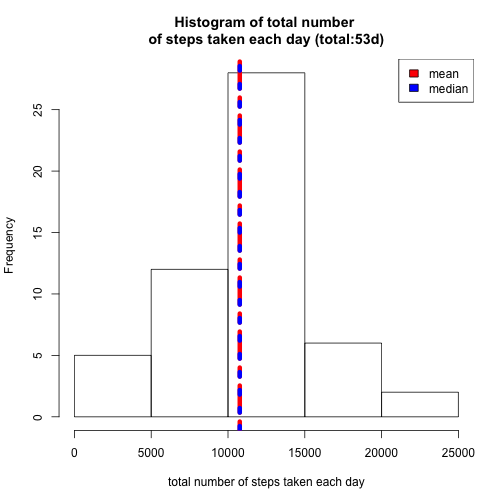
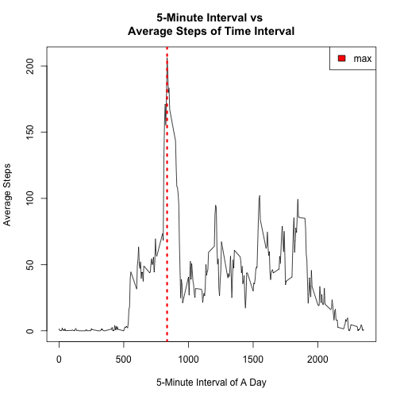
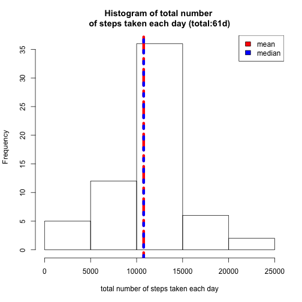
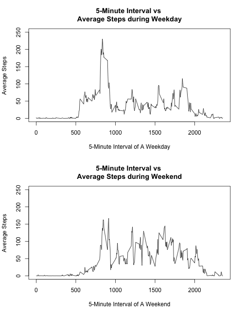

## Peer Assessment 1
* `-  Class Term:` repdata-011
* `-  Instructor:` Dr. Roger Peng
* `-----  Author:` Peter Wang
* `-------  Date:` 02/11/2015

- - - - - - - 
- - - - - - - 
- - - - - - - 

## I. Loading and preprocessing the data

Load the data "activity.csv", make sure the file is under the same directory.

```r
data_all<-read.csv("activity.csv",header=TRUE)
```

- - - - - - - 
- - - - - - - 

## II. What is mean total number of steps taken per day?

For this part, the missing values in the dataset are ignored.

```r
data<-data_all[!is.na(data_all$steps),]
```


Use tapply to get sum of `steps` in date category, also remove the categories with no value.

```r
plot1_data<-tapply(data$steps,data$date,sum)
plot1_data<-plot1_data[!is.na(plot1_data)]
```

Calculate `mean`.

```
## [1] 10766.19
```

Calculate `median`.

```
## [1] 10765
```

Draw histogram to draw sum of `steps`. Add red vertical line to show "mean", blue line to show "median".

```r
hist(plot1_data,
     xlab="total number of steps taken each day",
     main="Histogram of total number \nof steps taken each day (total:53d)")
abline(v=mean(plot1_data),col="red",lwd=6,lty=6)
abline(v=median(plot1_data),col="blue",lwd=6,lty=3)
legend("topright", c("mean", "median"), fill=c("red", "blue"))
```

 

- - - - - - - 
- - - - - - - 

## III. What is the average daily activity pattern?

Use tapply to calculate sum of `steps` data by `interval` category.

```r
plot2_data<-tapply(data$steps,data$interval,sum)
```

Divide the sum by the amount of `date`.

```r
plot2_data<-plot2_data/length(unique(data$date))
```

Make a time series plot (type = "l") of the `5-minute interval` (x-axis) and the `average number of steps` taken, averaged across all days (y-axis).

```r
plot(as.numeric(names(plot2_data)),plot2_data,type="l",
     main="5-Minute Interval vs \nAverage Steps of Time Interval",
     xlab="5-Minute Interval of A Day",
     ylab="Average Steps")
abline(v=as.numeric(names(plot2_data[plot2_data==max(plot2_data)])),
       col="red",lwd=3,lty=3)
legend("topright", c("max"), fill=c("red"))
```

 

Also, at this specific 5-minute time interval contains the max number of steps.

```
## [1] "835"
```

- - - - - - - 
- - - - - - - 

## IV. Imputing missing values

Read the rows that contain `NA` from original dataset.

```r
data_na<-data_all[is.na(data_all$steps),]
```

Replace the `NA` value with the average 5-minute interval calculated value from previous steps II.

```r
data_na$steps<-plot2_data[(as.integer(data_na$interval/100)*12+as.integer((data_na$interval%%100)/5)+1)]
```

Combine the data with replaced NA value with the full dataset.

```r
data_final<-rbind(data_na,data)
```

Generate a hist data of `total numbers of steps` taken each day.

```r
plot3_data<-tapply(data_final$steps,data_final$date,sum)
```

Calculate `mean`.

```
## [1] 10766.19
```

Calculate `median`.

```
## [1] 10766.19
```

Make a histogram of the `total number of steps` taken each day and Calculate and report the `mean` and `median` total number of steps taken per day. 

```r
hist(plot3_data,
     xlab="total number of steps taken each day",
     main="Histogram of total number \nof steps taken each day (total:61d)")
abline(v=mean(plot3_data),col="red",lwd=6,lty=6)
abline(v=median(plot3_data),col="blue",lwd=6,lty=3)
legend("topright", c("mean", "median"), fill=c("red", "blue"))
```

 

Note the `mean from this plot` is same as `mean from the previous one`, it's because the the values that were added to replace `NA` has a average value of `mean`. The `median` acted as in similar manner. 


- - - - - - - 
- - - - - - - 

## IV. Imputing missing values

Generate a weekday list from the original dataset.

```r
weekday_list<-weekdays(as.Date(data_final$date))
```

Replace `Sunday` and `Saturday` with the keyword `weekend`.

```r
ind <- which(weekday_list=="Sunday"|weekday_list=="Saturday")
weekday_list[ind] <- "weekend"
```

Replace any `non-weekend` with `weekday`.

```r
ind <- which(!weekday_list=="weekend")
weekday_list[ind] <- "weekday"
```

Insert a datafram `factorial variable` called `weekday` that contains `weekday` and `weekend`.

```r
data_final$weekday<-factor(weekday_list,labels = c("weekday", "weekend"))
```

Use tapply to get the sum of `steps` in `weekday` and `weekend`.

```r
plot4_data<-tapply(data_final$steps,list(data_final$interval,data_final$weekday),sum)
plot4_data<-data.frame(plot4_data)
```

Calculate the average steps by dividing `sum steps` by the amount of `weekday` and `weekend`, repectively.

```r
plot4_data$weekday<-plot4_data$weekday/(12960/288)
plot4_data$weekend<-plot4_data$weekend/(4608/288)
```

Plot the `top` graph, which represents Average Steps during `Weekday` in 5-Minute Interval. Plot the `bottom` graph, which represents Average Steps during `Weekend` in 5-Minute Interval.

```r
par(mfrow=c(2,1))
plot(as.numeric(rownames(plot4_data)),plot4_data$weekday,type="l",
     main="5-Minute Interval vs \nAverage Steps during Weekday",
     ylim=range(0:250),
     xlab="5-Minute Interval of A Weekday",
     ylab="Average Steps")
plot(as.numeric(rownames(plot4_data)),plot4_data$weekend,type="l",
     main="5-Minute Interval vs \nAverage Steps during Weekend",
     ylim=range(0:250),
     xlab="5-Minute Interval of A Weekend",
     ylab="Average Steps")
```

 

It can be observed that the activity patterns during weekdays are tend to be narrowed to one to two time sections, while as in weekends, the activity patterns are more spreaded-out. The activity peak during weekdays is higher than activity peak during weekends.


- - - - - - - 
